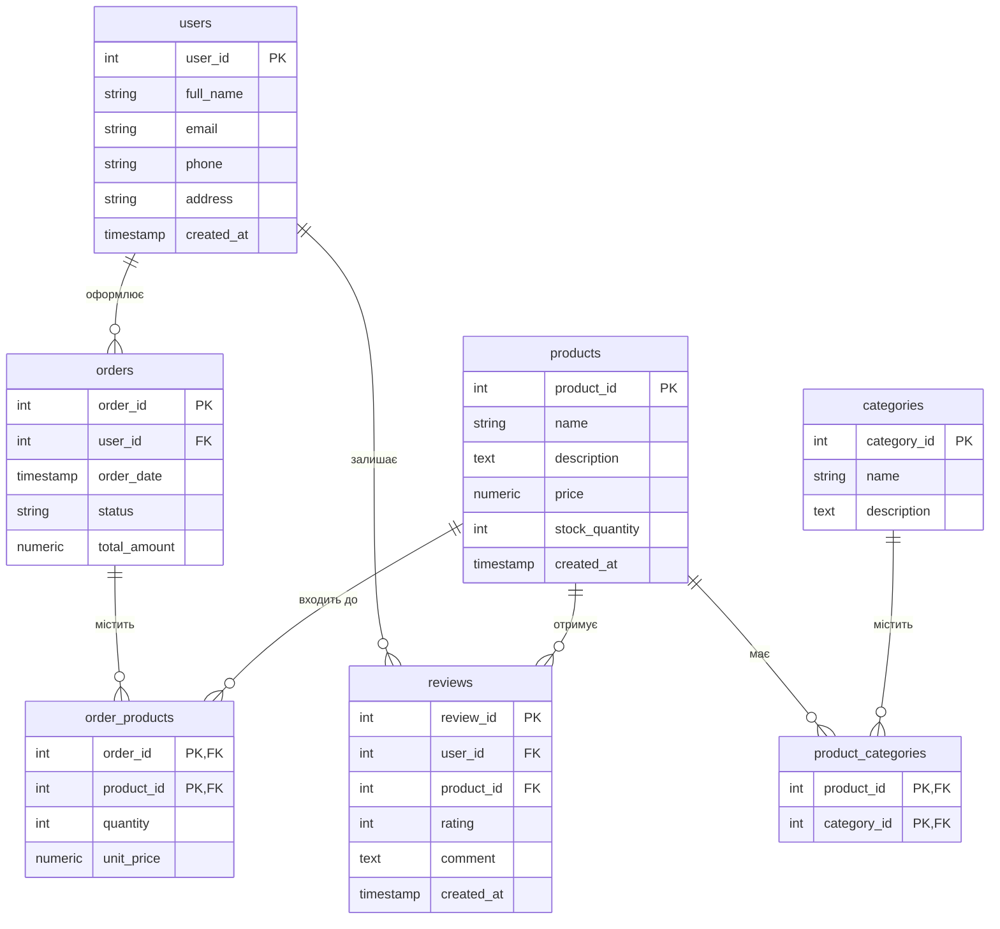

# ER-діаграма бази даних інтернет-магазину

```mermaid
erDiagram
    users ||--o{ orders : "оформлює"
    users ||--o{ reviews : "залишає"
    products ||--o{ reviews : "отримує"
    products ||--o{ product_categories : "має"
    categories ||--o{ product_categories : "містить"
    orders ||--o{ order_products : "містить"
    products ||--o{ order_products : "входить до"

    users {
        int user_id PK
        string full_name
        string email
        string phone
        string address
        timestamp created_at
    }

    products {
        int product_id PK
        string name
        text description
        numeric price
        int stock_quantity
        timestamp created_at
    }

    categories {
        int category_id PK
        string name
        text description
    }

    orders {
        int order_id PK
        int user_id FK
        timestamp order_date
        string status
        numeric total_amount
    }

    reviews {
        int review_id PK
        int user_id FK
        int product_id FK
        int rating
        text comment
        timestamp created_at
    }

    product_categories {
        int product_id PK, FK
        int category_id PK, FK
    }

    order_products {
        int order_id PK, FK
        int product_id PK, FK
        int quantity
        numeric unit_price
    }
```
